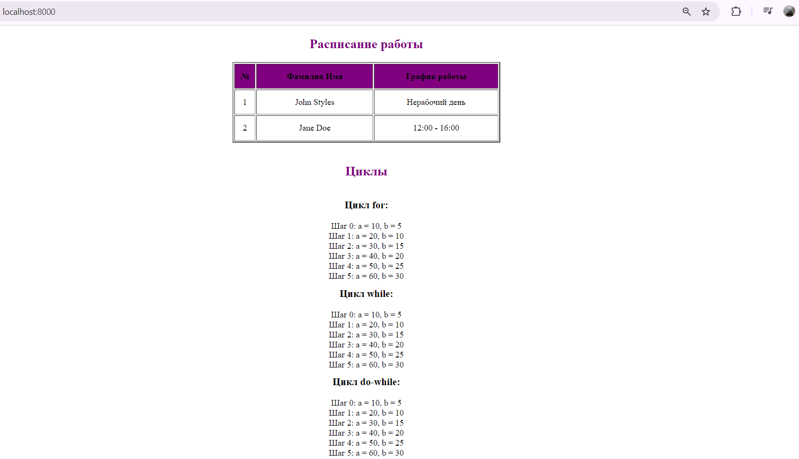

#  Лабораторная работа: Установка и настройка PHP  
 Митков Евгений,
 i2302

# Лабораторная работа №2

## Цель
Освоить использование условных конструкций и циклов в PHP.

## Задание 1. Условные конструкции
Используйте функцию `date()` для формирования расписания сотрудников на основе текущего дня недели.

### Таблица сотрудников и их график работы

| №   | Фамилия Имя | График работы |
| --- | ----------- | ------------- |
| 1   | John Styles | xx - xx       |
| 2   | Jane Doe    | yy - yy       |

### Правила формирования расписания

- **Для John Styles:**  
  - Рабочие дни: **понедельник, среда, пятница** → `08:00 - 12:00`
  - В остальные дни → `Нерабочий день`

- **Для Jane Doe:**  
  - Рабочие дни: **вторник, четверг, суббота** → `12:00 - 16:00`
  - В остальные дни → `Нерабочий день`

## Реализация

```php
<?php
$weekdate = date('4');

function getSchedule($employee)
{
    global $weekdate;

    if ($employee === 'John Styles') {
        return in_array($weekdate, [1, 3, 5]) ? '08:00 - 12:00' : 'Нерабочий день';
    } elseif ($employee === 'Jane Doe') {
        return in_array($weekdate, [2, 4, 6]) ? '12:00 - 16:00' : 'Нерабочий день';
    }
    return 'Неизвестный сотрудник';
}


## Краткое пояснение
1. `date('N')` — получает текущий день недели в числовом формате (1 = понедельник, 7 = воскресенье).

2. Функция `getSchedule($employee)` определяет расписание работы:
   - Используется `in_array($weekdate, [...])` для проверки, является ли день рабочим.
   - Если день совпадает с рабочим графиком сотрудника, возвращается время работы.
   - В противном случае — `Нерабочий день`.
```
### Добавьте вывод промежуточных значений $a и $b на каждом шаге цикла.
```
<?php
$a = 0;
$b = 0;
for ($i = 0; $i <= 5; $i++) {
    $a += 10;
    $b += 5;
    echo "Шаг $i: a = $a, b = $b<br>";
}
?>
```
### Реализуйте аналогичный код с while
```php
<?php
$a = 0;
$b = 0;
$i = 0;
while ($i <= 5) {
    $a += 10;
    $b += 5;
    echo "Шаг $i: a = $a, b = $b<br>";
    $i++;
}
?>
```
### Реализуйте аналогичный код с do while
```php
<?php
$a = 0;
$b = 0;
$i = 0;
do {
    $a += 10;
    $b += 5;
    echo "Шаг $i: a = $a, b = $b<br>";
    $i++;
} while ($i <= 5);
?>
```
## Результат сайта, я выбрал день недели - четверг.
   

## Контрольные вопросы
1. **В чем разница между циклами for, while и do-while?**
   
   - `for` – если точно знаем количество повторений.
   - `while` – если не знаем, но есть условие.
   - `do-while` – если код должен выполниться хотя бы один раз.

2. **Как работает тернарный оператор `? :` в PHP?**
   
   Тернарный оператор — это короткая форма `if-else`, позволяющая записать условие в одной строке. Сначала проверяется условие, и если оно истинно, выполняется первое значение, иначе — второе.
   ```php
   $условие ? $значение_если_истина : $значение_если_ложь;
   ```
   **Как работает:** `условие ? если_истина : если_ложь;` Если условие верно → берется первый вариант. Если условие неверно → берется второй вариант.

3. **Что произойдет, если в `do-while` поставить условие, которое изначально ложно?**
   
   Если в `do-while` условие сразу ложно, код внутри цикла все равно выполнится хотя бы один раз, а затем цикл завершится. Это главное отличие от `while`, где код вообще не выполнится, если условие ложно с самого начала.1. `for` используется, когда количество итераций известно заранее. `while` — когда количество итераций зависит от условия. `do-while` выполняет тело цикла хотя бы один раз, даже если условие изначально ложно.


## Вывод

В ходе выполнения лабораторной работы были изучены и применены условные конструкции (if, тернарный оператор) и циклы (for, while, do-while) в PHP. Было реализовано динамическое расписание сотрудников, зависящее от текущего дня недели, а также продемонстрирована работа циклов с поэтапным изменением значений переменных. Данная работа позволила закрепить понимание логики выполнения управляющих конструкций в PHP и их практическое применение в разработке веб-приложений.

## Библиография

- Официальная документация PHP: [https://www.php.net/manual/ru/](https://www.php.net/manual/ru/)
- Работа с циклами в PHP: [https://www.php.net/manual/ru/control-structures.for.php](https://www.php.net/manual/ru/control-structures.for.php)
- Функция `date()` в PHP: [https://www.php.net/manual/ru/function.date.php](https://www.php.net/manual/ru/function.date.php)
