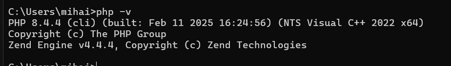
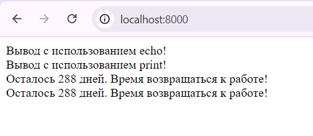

#  Лабораторная работа: Установка и настройка PHP  
 Митков Евгений,
 i2302

## Цель работы  
Ознакомиться с процессом установки и настройки среды разработки для PHP, а также выполнить базовую программу на этом языке.  

## 🔹 Шаг 1: Установка PHP вручную  

###  Действия:  
1. Перешел на официальный сайт PHP: [php.net](https://www.php.net/downloads).  
2. Скачал версию PHP, подходящую для моей операционной системы.  
3. Разархивировал файлы в директорию: `C:\Program Files\php`.  
4. Настроил переменные среды для работы с PHP:  
   - Открыл **Параметры системы** (`Win + R → sysdm.cpl`).  
   - В разделе **Дополнительно** → **Переменные среды** добавил путь `C:\Program Files\php` в `Path`.  
5. Проверил успешность установки командой:  

6. php -v
   В результате получил информацию о версии PHP, например:  


## 🔹 Шаг 2: Альтернативная установка PHP через XAMPP  

###  Действия:  
1. Открыл сайт [apachefriends.org](https://www.apachefriends.org) и скачал XAMPP.  
2. Установил XAMPP, выбрав необходимые компоненты:  
   - **Apache**  
   - **PHP**  
   - **phpMyAdmin**  
3. Запустил XAMPP Control Panel и активировал **Apache**.  
4. Проверил работу сервера, открыв в браузере `http://localhost`.  

## 🔹 Шаг 3: Создание первой программы на PHP  

1. Создал новую папку для проекта:  
   
2.  mkdir C:\Program Files\php

3. Внутри папки создал файл `index.php` с кодом:  

   <?php
   echo "Привет, мир!";
   ?>

4. Запустил встроенный сервер PHP:  
   php -S localhost:8000

5. Проверил результат, открыв [http://localhost:8000](http://localhost:8000) в браузере.  

## 🔹 Шаг 4: Работа с выводом данных в PHP  

1. Создал новый файл `output.php` с таким кодом:  
   ```php
   <?php
   echo "Вывод с использованием echo!<br>";
   print "Вывод с использованием print!<br>";
   ?>
   ```
Открыл этот файл в браузере, убедившись, что обе строки успешно выводятся.  


## 🔹 Шаг 4: Работа с выводом данных в PHP  

 Внутри папки создал файл `index.php` с кодом:  
   ```php
   <?php
   $number = 288;
   $text = "Время возвращаться к работе!";
   
   echo "Вывод с использованием echo!<br>";
   print "Вывод с использованием print!<br>";
   
   echo "Осталось $number дней. $text<br>";
   print "Осталось " . $number . " дней. " . $text . "<br>";
   ?>
   ```

## 📖 Контрольные вопросы  

### 1. Какие существуют способы установки PHP?  
  Основные методы:
- Ручная установка с [официального сайта](https://www.php.net/downloads).  
- Использование XAMPP/WAMP/MAMP– предустановленные пакеты с Apache, MySQL и PHP.  
- Пакетные менеджеры (`apt`, `yum`, `dnf`, `brew`, `choco`).  


### 2. Как проверить, установлен ли PHP?  
  Способы проверки:
- Ввести в терминале:  
  php -v

- Создать файл `index.php` и добавить код:  
  ```php
  <?php phpinfo(); ?>
  ```
  Затем открыть `http://localhost/info.php` в браузере.  

### 3. Различия между `echo` и `print`  

| Оператор  | Особенности |
|-----------|------------|
| `echo`    | Работает быстрее, поддерживает несколько аргументов, не возвращает значение. |
| `print`   | Возвращает `1`, работает только с одним аргументом. |

## Вывод  
В ходе работы я установил и настроил PHP двумя способами, освоил базовые команды и научился запускать встроенный сервер. Также я разобрался с разницей между `echo` и `print` и научился работать с переменными в PHP.